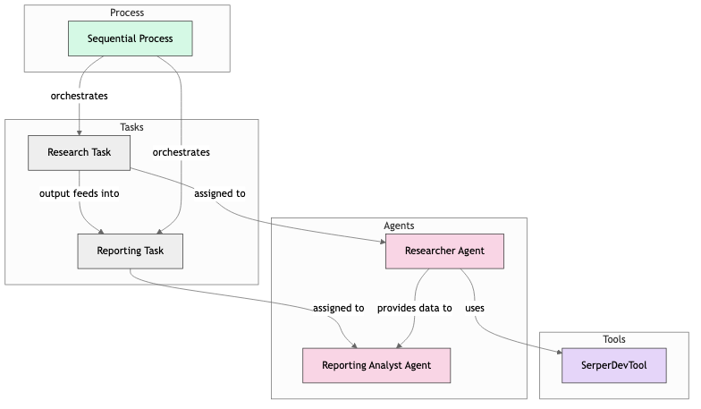

# LatestAiDevelopment Crew

Welcome to the LatestAiDevelopment Crew project, powered by [crewAI](https://crewai.com). This template is designed to help you set up a multi-agent AI system with ease, leveraging the powerful and flexible framework provided by crewAI. Our goal is to enable your agents to collaborate effectively on complex tasks, maximizing their collective intelligence and capabilities.

## Quick Start (Docker)

Prerequisite: Docker installed.

1. **Scaffold a new project**:
   ```bash
   docker pull tonykip/crewai:cli   # CrewAI CLI image
   docker run --rm -v "$(pwd)":/work tonykip/crewai:cli create crew my_crew
   cd my_crew
   ```
2. Copy and fill `.env`:
   ```bash
   cp .env_example .env
   ```
   Add your MODEL, OPENAI_API_KEY, and SERPER_API_KEY in `.env`.
3. **Build & Run**:
   ```bash
   # Build official project image
   docker build -t tonykip/crewai:latest .
   # Run using the official project image
   docker run --rm --env-file .env -v "$(pwd)/output":/app/output tonykip/crewai:latest run
   ```

## Image Types

There are two official Docker images published under the `tonykip` namespace:

- **CLI image** (`tonykip/crewai:cli`):
  - Includes only the CrewAI CLI tools (`uv`, `crewai[tools]`).
  - Does _not_ include any project code.
  - Use to scaffold new crews (`crewai create crew ...`) or to run any local project directory via bind-mount.

- **Project image** (`tonykip/crewai:latest`):
  - Contains your project code in `/app` with all dependencies pre-installed.
  - Entrypoint is `crewai` with default `run` command.
  - Use to execute your crew (`run`, `train`, `test`, etc.) out-of-the-box.

**Usage Examples:**

```bash
# Scaffold a new crew
mkdir my_crew && cd my_crew
docker run -it --rm -v "$(pwd)":/work tonykip/crewai:cli create crew .

# Run the crew
docker run --rm --env-file .env -v "$(pwd)/output":/app/output tonykip/crewai:latest
```

### Note on API Keys and Model Providers
- **OpenAI and Serper API keys are optional.**
- During the interactive setup, you can choose from a variety of models and providers—including local models like Ollama.
- If you do not want to use OpenAI or Serper, simply select a different provider when prompted.
- You can always update your model/provider settings later in your crew's configuration files.

## Troubleshooting: Docker Dependency Conflicts & Clean Runs

If you encounter dependency errors like:

```
No solution found when resolving dependencies for split
... your project's requirements are unsatisfiable.
```

This is usually due to a conflict between the dependencies required by CrewAI and any stale lock files (like `uv.lock`) in your project directory. This problem may not appear when running CrewAI natively (on your host) because a fresh virtual environment is created, but Docker often uses a system install and can be stricter or affected by leftover files.

### Why does this happen?
- **CrewAI manages its own dependencies** (like `litellm`) and expects to resolve them cleanly.
- If a `uv.lock` (or similar) file exists from a previous run or a different environment, Docker's dependency resolver may pick it up and fail.
- Native runs use a new virtual environment each time, but Docker images often install dependencies globally or in a shared context, making conflicts more likely.

### How to Fix: Clean Run in Docker

1. **Start an Interactive Shell in the CLI Container**
   ```sh
   docker run --rm -it --entrypoint bash -v "$(pwd)":/work tonykip/crewai:cli
   ```
   This opens a bash shell inside the container with your project directory mounted at `/work`.

2. **Inside the Container, Clean Up and Run**
   ```sh
   cd /work
   rm -f uv.lock
   crewai run
   ```
   - This removes any stale lock file and runs CrewAI with a fresh dependency resolution.

3. **Why this works:**
   - Removing `uv.lock` ensures that CrewAI and its tools can install the correct versions of dependencies (especially `litellm`).
   - This approach closely matches how CrewAI works natively and avoids most Docker-specific dependency issues.

### Additional Tips
- If you still have issues, make sure your `pyproject.toml` does **not** explicitly specify a conflicting `litellm` version. CrewAI will install the correct one.
- Always check for and remove stale lock files after copying or reusing project directories.
- If you want to automate this, you can add a pre-run script or Docker entrypoint that deletes `uv.lock` before running CrewAI.

## Running CrewAI Docker Images on Windows

CrewAI Docker images are built for `amd64` (Intel/AMD) and `arm64` (Apple Silicon/Windows ARM) Linux architectures. You can run these images seamlessly on Windows using Docker Desktop. 

### Why Linux Images Work on Windows
- **Docker Desktop for Windows** uses a lightweight Linux VM (via WSL2 or Hyper-V) to run Linux containers.
- You do **not** need a Windows-native Docker image to use CrewAI on Windows.
- This approach is standard for most Python and AI/ML projects.

### Prerequisites
- **Windows 10/11** (Pro/Enterprise/Education recommended for Hyper-V, but WSL2 works on Home)
- **Docker Desktop** installed ([Get Docker Desktop](https://www.docker.com/products/docker-desktop/))
- **WSL2** enabled (recommended, Docker Desktop will guide you through setup)

### Step-by-Step: Running CrewAI on Windows
1. **Install Docker Desktop**
   - Download and install from [docker.com](https://www.docker.com/products/docker-desktop/).
   - Follow prompts to enable WSL2 (if not already enabled).

2. **Open PowerShell or Command Prompt**

3. **Run the CrewAI CLI image:**
   ```sh
   docker run --rm -it tonykip/crewai:cli --help
   ```
   Or run a project image:
   ```sh
   docker run --rm -it tonykip/crewai:latest
   ```

4. **Mount your local project directory (optional):**
   ```sh
   docker run --rm -it -v %cd%:/work tonykip/crewai:cli
   ```
   - Replace `%cd%` with your project path if not running from your project root.
   - On Git Bash or WSL, use `$(pwd)` instead of `%cd%`.

### Notes
- **File Sharing:** Docker Desktop automatically shares your Windows files with Linux containers. If you run into permission issues, check Docker Desktop settings under "Resources > File Sharing".
- **Networking:** Use `localhost` in your container to access services running on your Windows host.
- **Performance:** WSL2 offers near-native performance for most workloads.

For more details, see the [Docker Desktop documentation](https://docs.docker.com/desktop/windows/wsl/).

## Publish Your Image

From your project root, build and push to Docker Hub:
```bash
  # Project image
  docker build -t tonykip/crewai:latest .
  docker push tonykip/crewai:latest
  # CLI image
  docker build -f Dockerfile.cli -t tonykip/crewai:cli .
  docker push tonykip/crewai:cli
```

## Installation

Ensure you have Python >=3.10 <3.13 installed on your system. This project uses [UV](https://docs.astral.sh/uv/) for dependency management and package handling, offering a seamless setup and execution experience.

First, if you haven't already, install uv:

```bash
pip install uv
```

Next, navigate to your project directory and install the dependencies:

(Optional) Lock the dependencies and install them by using the CLI command:
```bash
crewai install
```
### Customizing

**Add your `OPENAI_API_KEY` into the `.env` file**

- Modify `src/latest_ai_development/config/agents.yaml` to define your agents
- Modify `src/latest_ai_development/config/tasks.yaml` to define your tasks
- Modify `src/latest_ai_development/crew.py` to add your own logic, tools and specific args
- Modify `src/latest_ai_development/main.py` to add custom inputs for your agents and tasks

## Running the Project

To kickstart your crew of AI agents and begin task execution, run this from the root folder of your project:

```bash
$ crewai run
```

This command initializes the latest-ai-development Crew, assembling the agents and assigning them tasks as defined in your configuration.

This example, unmodified, will run the create a `report.md` file with the output of a research on LLMs in the root folder.

## Scaffolding via Docker CLI

If you haven’t installed CrewAI locally or need a consistent environment across machines, you can use our `crewai-cli` image to scaffold new projects:

1. **Pull the prebuilt CLI image**:

    ```bash
    docker pull tonykip/crewai:cli
    ```

2. **Create a fresh crew** in a host directory:

    ```bash
    mkdir my_new_crew
    docker run -it --rm -v "$(pwd)/my_new_crew":/work tonykip/crewai:cli create crew my_new_crew
    ```

   This generates all scaffolding in `my_new_crew` without installing anything on your host.

3. **Enter and run**:

    ```bash
    cd my_new_crew
    docker run --rm -v "$(pwd)":/app -v "$(pwd)/output":/app/output \
      --env-file .env tonykip/crewai:latest run
    ```

After this, continue with development as usual—your code is in `my_new_crew/`.

### Iterative Development

All crew files (e.g., `config/tasks.yaml`, `config/agents.yaml`, `src/crew.py`, `src/main.py`, custom tools, etc.) live on your host and are bind-mounted into the container. To edit and test:

1. **Edit on your host**: open files in your preferred editor.
2. **Re-run tasks**:
   ```bash
   docker-compose run --rm crewai run
   ```
3. **Open a shell** inside the container for manual commands:
   ```bash
   docker-compose run --rm crewai bash
   ```
4. **Invoke any CLI script** from `[project.scripts]`, e.g.: 
   ```bash
   docker-compose run --rm crewai train
   docker-compose run --rm crewai test
   ```

This provides a seamless edit–run loop without installing anything locally.

## Understanding Your Crew

The latest-ai-development Crew is composed of multiple AI agents, each with unique roles, goals, and tools. These agents collaborate on a series of tasks, defined in `config/tasks.yaml`, leveraging their collective skills to achieve complex objectives. The `config/agents.yaml` file outlines the capabilities and configurations of each agent in your crew.



The diagram above illustrates the flow of the CrewAI project:
- The Researcher Agent uses the SerperDevTool to gather information
- The Research Task is assigned to the Researcher Agent
- The Reporting Task is assigned to the Reporting Analyst Agent
- The agents work in a sequential process, with the Researcher's output feeding into the Reporting Analyst's work
- The final output is a comprehensive report on the latest AI developments

## Video Tutorial

Watch this step-by-step tutorial on how to get started with CrewAI:

[](https://youtu.be/-kSOTtYzgEw)

This tutorial covers:
- Installing UV and CrewAI
- Setting up your development environment
- Creating a project scaffold
- Understanding the key components: Agents, Tasks, and Crews
- Running your first multi-agent AI system

## Support

For support, questions, or feedback regarding the LatestAiDevelopment Crew or crewAI.
- Visit our [documentation](https://docs.crewai.com)
- Reach out to us through our [GitHub repository](https://github.com/joaomdmoura/crewai)
- [Join our Community Forum](https://community.crewai.com/)
- [Chat with our docs](https://chatg.pt/DWjSBZn)

Let's create wonders together with the power and simplicity of crewAI.
