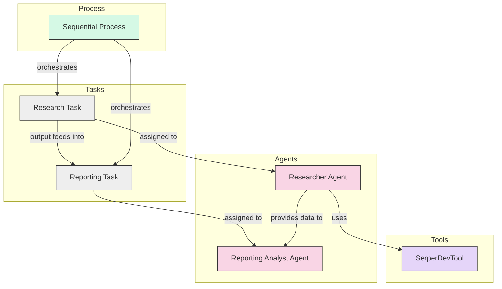

```mermaid
graph TD
    subgraph Agents
        A1[Researcher Agent] 
        A2[Reporting Analyst Agent]
    end
    
    subgraph Tasks
        T1[Research Task]
        T2[Reporting Task]
    end
    
    subgraph Process
        P1[Sequential Process]
    end
    
    subgraph Tools
        Tool1[SerperDevTool]
    end
    
    A1 -->|uses| Tool1
    T1 -->|assigned to| A1
    T2 -->|assigned to| A2
    A1 -->|provides data to| A2
    T1 -->|output feeds into| T2
    P1 -->|orchestrates| T1
    P1 -->|orchestrates| T2
    
    classDef agents fill:#f9d5e5,stroke:#333,stroke-width:1px;
    classDef tasks fill:#eeeeee,stroke:#333,stroke-width:1px;
    classDef process fill:#d5f9e5,stroke:#333,stroke-width:1px;
    classDef tools fill:#e5d5f9,stroke:#333,stroke-width:1px;
    
    class A1,A2 agents;
    class T1,T2 tasks;
    class P1 process;
    class Tool1 tools;
```
